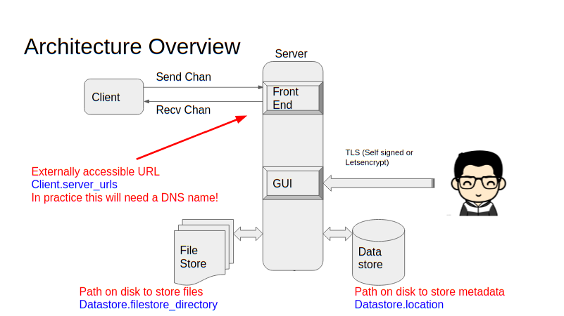

The simplest way to deploy Velociraptor is via a self-signed,
stand-alone deployment. This page will help you configure such a
deployment for use as a stand-alone test environment, or even a
production environment up to about 10,000 clients.  Later we'll
see how to deploy Velociraptor for other scenarios.

## Overview

Before we start, it's useful to see how a typical Velociraptor deployment
looks at a high level:



Endpoint systems (also called *clients*) connect to the server (also
called the *frontend*). The administrator (digital forensic
investigator, threat hunter, SOC analyst, IT security operations,
etc.) uses their browser to connect to the Velociraptor GUI over
SSL. The administrator can query endpoints to collect forensic
artifacts or for continual real-time monitoring.

The Velociraptor binary distributed through our [Github
releases](https://github.com/Velocidex/velociraptor/releases) page contains all
Velociraptor functionality in one binary, without any libraries or
external dependencies. The same executable can act as a server or a
client depending on command line options, making it easy to deploy and
use. Just ensure you use the correct binary for the operating system
on your server and endpoints - Windows, Linux or Mac (Darwin).

A Velociraptor server will also operate with Velociraptor endpoints
from any supported operating system. For example, a Velociraptor
server running on Linux will support endpoints running Windows, Linux
and Mac, so long as the server and endpoints have correct and
corresponding configuration files - see below.

## 1. Decide where to locate the Velociraptor server

For testing purposes, you don't even need two computers. You can
simply run both the Velociraptor server and a client on the same
computer. You can even use the same Velociraptor executable - just
specify the appropriate configuration files when starting the server
and client processes (see below).

For more interesting testing, you'll want to setup a dedicated server
and deploy to a group of endpoints. You can use virtual machines, but
it's not essential, since Velociraptor requires no libraries or
external dependencies and has an extremely light installation
footprint, only writing the configuration, state and history files it
needs, all of which can easily be deleted after testing, along with
the executable.

However, when setting up a longer-term deployment, the main decision is
whether the Velociraptor server should be inside or outside your
network. Here are some considerations:

#### Server inside the network

* Doesn't require external server space nor an external domain

* Doesn't require allowing egress from inside your network, since all
  client-server communications remain inside the network

* However clients are only accessible when they're inside the network (or possibly when connecting via VPN).

#### Server outside the network

* Requires external server space; we recommend a cloud-based platform such as AWS
* Works best with an external resolvable DNS name - dynamic DNS is useful here

* Requires allowing egress connections from inside your network to the
  Velociraptor server, which can be locked down to only the default
  service ports - TCP/8000 for client-server comms and TCP/8889 for
  the administrator to access the GUI

* A significant benefit is that clients will still communicate with
  the server when outside your network perimeter, providing excellent
  accessibility.

#### Inside the network, with external accessibility

Another possibility is setting up the Velociraptor server inside the
network, but allowing clients to connect from the Internet. This
provides most of the benefits of both deployment options described
above, however will require allowing ingress access and possibly NAT
on your network perimeter.

## 2. Configure DNS and ports as required

If you want endpoints to reach the Velociraptor server across the
Internet, you must provide an external DNS name for the server. If you
use a dynamic external IP address you might want to use dynamic DNS as
well. The DNS name will be used by the clients to connect to the
frontends, so you need to ensure the port is open and DNS names
resolve properly.

The default service ports listening on the server are as follows,
although please note that these can be easily changed in the client
and server config files that we'll soon be creating:

* TCP/8000 for client-server communications
* TCP/8889 for access to the GUI, which is only required for users of the server
* TCP/8001 if you require access to the API, which is not required by default.

{}

It might be tempting to specify an IP address here, especially if you
have a static IP or this is an internal deployment. This is not
recommended, since if you need to change the IP address, existing
clients will continue to attempt to contact the old IP address,
rendering them unreachable.

{}

## 3. Generate the server and client configuration files

Now that you've decided on your server location and setup any
necessary networking, it's time to create the server and client
configuration files.

Velociraptor uses a pair of configuration files to control the server
and endpoints. These define settings such as the location of the
server, the communication ports and the encryption keys used to secure
client-server comms.

Therefore, our next step is to generate configuration files for our new
deployment. The easiest way to get started is using the interactive
config generator, which will build a pre-configured deployment
type. These files are plain-text and you can easily edit them later to
change settings if required.

Start the interactive config generator as shown below. The various
options presented by the config generator are described further
below. Note these examples demonstrate configuration on a Linux
server, however the commands for Windows are almost identical; only
the locations of the folders you choose for the data stores will
differ.

```text
$ velociraptor config generate -i
? What OS will the server be deployed on? [Use arrows to move, type to filter]
> linux
  windows
  darwin
```

The config generator will ask whether the datastore should be implemented as
a file store or database store using MySQL. For this stand-alone deployment,
choose FileBaseDataStore. The database store is used for multiple frontend
server deployments, which is typically only necessary for environments with
more than 10,000 clients.

```text
? Please select the datastore implementation
  [Use arrows to move, type to filter]
> FileBaseDataStore
  MySQL

? Path to the datastore directory. /opt/velociraptor
```

After choosing the FileBaseDataStore option and then the directory location
to store the files, the generator prompts for the type of certificate to be
used for accessing the frontend web server.

```text
Welcome to the Velociraptor configuration generator
---------------------------------------------------

I will be creating a new deployment configuration for you. I will
begin by identifying what type of deployment you need.

  [Use arrows to move, space to select, type to filter]
  > Self Signed SSL
    Automatically provision certificates with Lets Encrypt
    Authenticate users with SSO
```

#### Self-signed SSL certificates

In a self-signed SSL deployment, communication between the user and
frontend occurs over TLS with self-signed certificates.

In this mode of operation, the endpoints will pin the server's
self-signed certificate and will in fact refuse to communicate with a
server signed via a public CA. This is actually more secure than
standard PKI, because even a compromised public CA can not sign for
the Velociraptor server.

GUI communications are authenticated with basic Auth and the GUI will
bind to localhost only on port 8889 by default -
i.e. https://localhost:8889/

Selecting `Self Signed SSL` proceeds to ask the following questions
and suggests default options.

Continue below for details about the remaining options presented in this
interactive configuration wizard.

```text
 Self Signed SSL
? Enter the frontend port to listen on. 8000
? What is the public DNS name of the Frontend (e.g. www.example.com): www.example.com
? Enter the port for the GUI to listen on. 8889
? Are you using Google Domains DynDNS? No
? GUI Username or email address to authorize (empty to end): mic
? GUI Username or email address to authorize (empty to end):

? Path to the logs directory. /opt/velociraptor/logs
? Where should i write the server config file? server.config.yaml
? Where should i write the client config file? client.config.yaml
```

#### Configuring the data store

Velociraptor uses two locations for data storage - you'll notice the
config generator asks where you want to put these.

* **Data Store** - holds details about clients and GUI users
* **Logs** - holds audit logs.

Pick locations with a reasonable amount of disk space, although this
will vary according to your requirements for collecting data from
endpoints and running hunts across your network.

These locations can also be changed by editing the configuration
files. If you want to move these, you'll need to move the folders and
edit the server configuration file.

Velociraptor does not enforce any particular data retention
policies. At any time the data store can be wiped and the server
restarted. If this happens, all the currently deployed clients will be
automatically re-enrolled with their existing client IDs. You might
want to archive any custom artifacts that you wrote however.

Since Velociraptor uses plain text files for its configuration, it's
possible to archive the entire deployment, or simply delete older
files with a scheduled or automated task, or a cron job.

#### Configuration files generated

The interactive config generator will create both a client and
server configuration file, which by default are stored in the local
folder and named as follows:

* server.config.yaml
* client.config.yaml

You can inspect these after the config generator is finished - they're
just plain text files.

#### Creating GUI users

The configuration process will create some GUI users, who will be
allowed to log into the admin GUI.

{}

Note that the accounts you create here are not related to any
operating system user accounts. They are completely separate and have
no security relationship, unless you choose to implement SSO.

{}

You can always add new users to the GUI using the command
`velociraptor --config server.config.yaml user add MyUserName --role
administrator`. User credentials are usually stored in the data
store and not in the config file (except for the root users created
with the wizard). If you need to change a user's password simply add
them again with the new password.

Each user account can have a different role attached to it. Currently
some of the more useful roles are "reader", "analyst", "investigator",
"artifact_writer" and "administrator".

## 4. Start the server

Now that you've generated a server configuration file -
`server.config.yaml` - it's time to start your Velociraptor server.

We start the server using the `frontend` command like so (the `-v`
flag causes verbose output to be shown in the terminal):

```text
# velociraptor --config server.config.yaml frontend -v
[INFO] 2020-09-07T17:46:01Z  _    __     __           _                  __ 
[INFO] 2020-09-07T17:46:01Z | |  / /__  / /___  _____(_)________ _____  / /_____  _____ 
[INFO] 2020-09-07T17:46:01Z | | / / _ \/ / __ \/ ___/ / ___/ __ `/ __ \/ __/ __ \/ ___/ 
[INFO] 2020-09-07T17:46:01Z | |/ /  __/ / /_/ / /__/ / /  / /_/ / /_/ / /_/ /_/ / / 
[INFO] 2020-09-07T17:46:01Z |___/\___/_/\____/\___/_/_/   \__,_/ .___/\__/\____/_/ 
[INFO] 2020-09-07T17:46:01Z                                   /_/ 
[INFO] 2020-09-07T17:46:01Z Digging deeper!                  https://www.velocidex.com 
[INFO] 2020-09-07T17:46:01Z This is Velociraptor 0.4.9 built on 2020-09-05T00:08:32+10:00 (6e3b235) 
[INFO] 2020-09-07T17:46:01Z Loading config from file server.config.yaml 
[INFO] 2020-09-07T17:46:01Z Starting Frontend. {"build_time":"2020-09-05T00:08:32+10:00","commit":"6e3b235","version":"0.4.9"}
[INFO] 2020-09-07T17:46:01Z Increased open file limit to 999999 
[INFO] 2020-09-07T17:46:01Z Starting Journal service. 
[INFO] 2020-09-07T17:46:01Z Starting the notification service. 
[INFO] 2020-09-07T17:46:01Z Starting Inventory Service 
[INFO] 2020-09-07T17:46:01Z Loaded 185 built in artifacts in 55.823848ms 
[INFO] 2020-09-07T17:46:01Z Starting Label service. 
[INFO] 2020-09-07T17:46:01Z Starting Hunt Dispatcher Service. 
[INFO] 2020-09-07T17:46:01Z Selected frontend configuration www.example.com:8000 
[INFO] 2020-09-07T17:46:01Z Starting Client Monitoring Service 
[INFO] 2020-09-07T17:46:01Z Creating default Client Monitoring Service 
[INFO] 2020-09-07T17:46:01Z Initial user mic not present, creating 
[INFO] 2020-09-07T17:46:01Z Server upgrade detected  -> 0.4.9... running upgrades. 
[INFO] 2020-09-07T17:46:01Z Upgrading tool OSQueryLinux {"Tool":{"name":"OSQueryLinux","github_project":"Velocidex/OSQuery-Releases","github_asset_regex":"linux-amd64"}}
[INFO] 2020-09-07T17:46:01Z Upgrading tool OSQueryDarwin {"Tool":{"name":"OSQueryDarwin","github_project":"Velocidex/OSQuery-Releases","github_asset_regex":"darwin-amd64"}}
[INFO] 2020-09-07T17:46:01Z Upgrading tool VelociraptorWindows {"Tool":{"name":"VelociraptorWindows","github_project":"Velocidex/velociraptor","github_asset_regex":"windows-amd64.exe","serve_locally":true}}
[INFO] 2020-09-07T17:46:01Z Upgrading tool VelociraptorWindows_x86 {"Tool":{"name":"VelociraptorWindows_x86","github_project":"Velocidex/velociraptor","github_asset_regex":"windows-386.exe","serve_locally":true}}
[INFO] 2020-09-07T17:46:01Z Upgrading tool VelociraptorLinux {"Tool":{"name":"VelociraptorLinux","github_project":"Velocidex/velociraptor","github_asset_regex":"linux-amd64","serve_locally":true}}
[INFO] 2020-09-07T17:46:01Z Upgrading tool VelociraptorDarwin {"Tool":{"name":"VelociraptorDarwin","github_project":"Velocidex/velociraptor","github_asset_regex":"darwin-amd64","serve_locally":true}}
[INFO] 2020-09-07T17:46:01Z Upgrading tool Bulk_Extractor {"Tool":{"name":"Bulk_Extractor","url":"https://github.com/4n6ist/bulk_extractor-rec/releases/download/rec03/bulk_extractor-rec03_x64.zip"}}
[INFO] 2020-09-07T17:46:01Z Upgrading tool WinPmem {"Tool":{"name":"WinPmem","url":"https://github.com/Velocidex/c-aff4/releases/download/v3.3.rc3/winpmem_v3.3.rc3.exe"}}
[INFO] 2020-09-07T17:46:01Z Upgrading tool OSQueryWindows {"Tool":{"name":"OSQueryWindows","github_project":"Velocidex/OSQuery-Releases","github_asset_regex":"windows-amd64.exe"}}
[INFO] 2020-09-07T17:46:02Z Upgrading tool Autorun_x86 {"Tool":{"name":"Autorun_x86","url":"https://live.sysinternals.com/tools/autorunsc.exe"}}
[INFO] 2020-09-07T17:46:02Z Upgrading tool Autorun_amd64 {"Tool":{"name":"Autorun_amd64","url":"https://live.sysinternals.com/tools/autorunsc64.exe"}}
[INFO] 2020-09-07T17:46:02Z Compiled all artifacts. 
[INFO] 2020-09-07T17:46:02Z Starting the hunt manager service. 
[INFO] 2020-09-07T17:46:02Z Starting Server Monitoring Service 
[INFO] 2020-09-07T17:46:02Z Starting Enrollment service. 
[INFO] 2020-09-07T17:46:02Z Starting VFS writing service. 
[INFO] 2020-09-07T17:46:02Z Collecting Server Event Artifact: Server.Monitor.Health/Prometheus 
[INFO] 2020-09-07T17:46:02Z Starting Server Artifact Runner Service 
[INFO] 2020-09-07T17:46:02Z Starting gRPC API server on 127.0.0.1:8001  
[INFO] 2020-09-07T17:46:02Z Launched Prometheus monitoring server on 127.0.0.1:8003  
[INFO] 2020-09-07T17:46:02Z GUI is ready to handle TLS requests on https://127.0.0.1:8889/
[INFO] 2020-09-07T17:46:02Z Frontend is ready to handle client TLS requests at https://www.example.com:8000/ 
```

The info messages will indicate which port the GUI will listen on,
i.e. `https://127.0.0.1:8889`

## 5. Verify the GUI works

Start a browser and visit your GUI URL (remember, use HTTPS and the
default port is TCP/8889). In this mode, the GUI is served over TSL
with a self-signed certificate. Your browser will likely report an
error due to the unsigned certificate (which as mentioned above, can
actually be more secure than a certificate signed by a CA). **This is
perfectly fine** and you can click through these messages and continue
to the GUI web page.

You will now be presented with a login screen; login as the user you
created earlier during the configuration phase.


You can also obtain an SSL certificate from Let's Encrypt, to avoid
the browser warning being displayed. Details are provided in [Cloud
Deployment](../cloud).

## Server setup complete

Thats it! Well done.

You now have a Velociraptor server running and waiting for clients to
connect.

Now let's install some clients.
