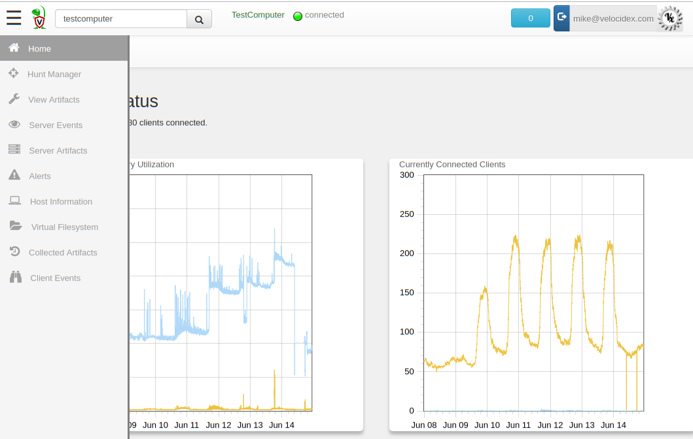

Velociraptor is a Digital Forensic and Incident Response tool, and the
Velociraptor user interface is the main tool used to create and
collect artifacts from endpoints.

The GUI allows for:

* Interactively collecting artifacts from endpoints.
* Exporting this collected data for offline analysis.
* Adding/Removing monitoring rules from all endpoints.
* Adding automated response rules on the server.
* Adding new artifacts based on new queries.

## The Dashboard

When initially logging into the application, you will be presented
with the `Dashboard`.

The dashboard presents pertinent information about the current
deployment:

1. The number of clients currently connected to the server.
2. A graph of the server's CPU and memory footprint.
3. A graph of the total number of clients connected.

You can choose to view the graphs over the last 1 day, 2 days or
week. You can zoom into a time range.

{}

The dashboard is actually an artifact itself called
`Server.Monitor.Health`. You can customize this artifact so the
dashboard can display information relevant to your deployment.

{}

## Navigation bar

The navigation bar is displayed on the left hand side of the
window. You can expand it to include descriptions by clicking on the
`Hamburger Icon` at the top left.

There are two sets of options. The first dealing with the server
itself, while client specific options require the client to be
selected first.

In the following pages we will discuss each specific option and show
it can be used.
