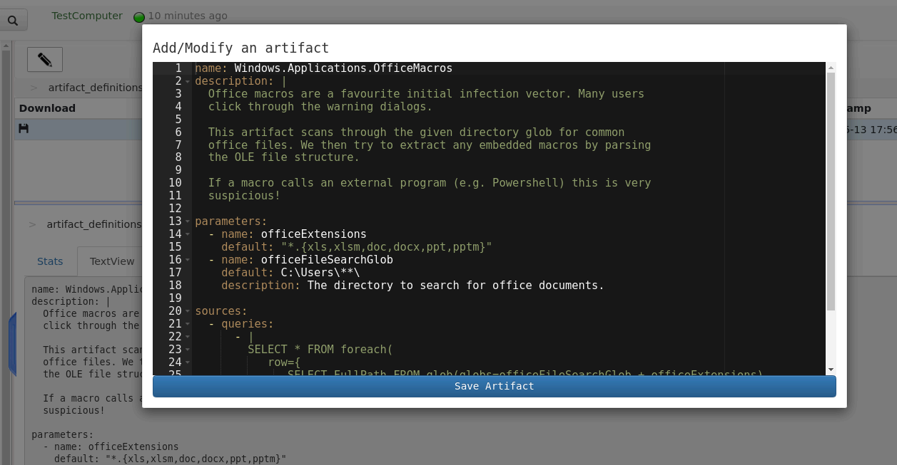

### Adding or Editing artifacts through the GUI

Velociraptor comes with a wide selection of built in artifacts, but
the real power of Velociraptor's query language lies in the ability of
users to customize and develop their own artifacts - flexibly
responding to their own needs.

This can be achieved via the `Server Management` screen - reachable
from the side bar menu.

The `Server Management` screen consists of a tree view on the left
hand side showing several high level categories of server
configuration to edit. The `artifact_definitions` category is used to
manage the server's artifact repository.

Below the top level we see the `builtin` and the `custom` folders. The
`builtin` folder contains all the artifacts that come with
Velociraptor. The artifacts are simply YAML files. Built in artifacts
are stored in the server binary, while custom artifacts are simply
stored in the Server's file store (where they can be easily backed up
if needed). You can see the content of the YAML file by selecting the
`TextView` tab.

Probably the easiest way to get familiar with artifacts is to edit an
existing artifact. Selecting an existing artifact and clicking the
`Add/Edit an artifact` toolbar button will open the artifact in an
editor.

If you keep the name of the artifact the same, then the saved artifact
will override the default built in one. Changing the name will add the
new artifact to the server repository. Note that custom artifacts are
always stored under the `custom` path. This way you can always go back
to see the original builtin artifact content.

Saving the artifact will validate it and ensure the VQL syntax is
correct. You may then search for it in the artifact collection screen.

{}

**A note about security**: Being able to add new artifacts gives a
user absolute control over clients **and** the server. This is because
a user can add arbitrary VQL to either a `Client Artifact` (so it can
run on the client with system level access) or to a `Server Artifact`
(which has access to all clients). Currently Velociraptor has a 2 tier
security model (Readonly users can not add artifacts, and full users
can do anything). This might change in future but until then you need
to be aware that Velociraptor admins are extremely privileged.

{}
