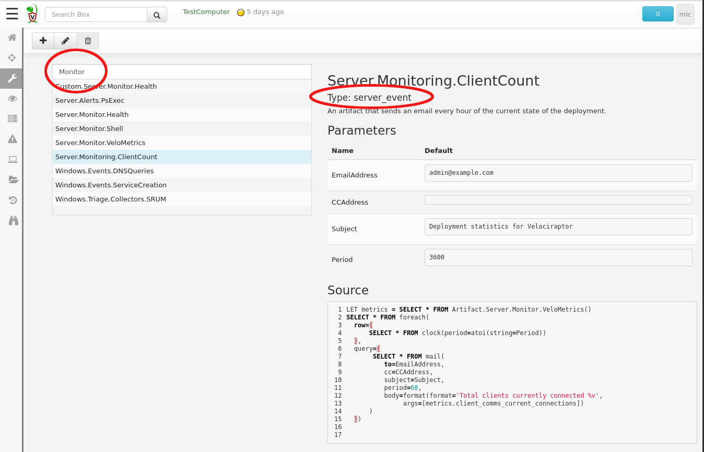
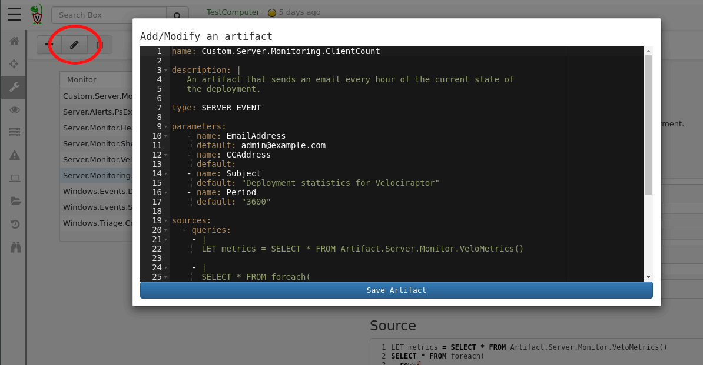

Velociraptor comes with a wide selection of built in artifacts, but
the real power of Velociraptor's query language lies in the ability of
users to customize and develop their own artifacts - flexibly
responding to their own needs. This is really what sets Velociraptor
apart from other tools: It is an open platform putting the user in
charge of designing their own perfect response and detection system.

As described previously, Artifacts are simply text files in YAML
format which encapsulate VQL queries. Artifacts are readable and
editable by end users, and are supposed to be reused and adapted as
seen fit.

{}

When thinking about writing a new artifact, you should check out any
similar artifacts that already exist. It is way easier to adapt an
existing artifact which does something similar to what you need.

{}

## Viewing existing artifacts

The `Customizing Artifacts` screen, reachable from the side bar menu,
offers a search interface to the Velociraptor artifacts
database. Velociraptor comes built in with a large number of useful
artifacts (you can contribute your own artifacts to the project by
sending us a pull request <i class="far fa-smile-wink"></i>).

Since there are many artifacts in the repository it is easier to
search for what you need. Simply type your search string in the search
bar and the UI will suggest artifacts for you to look more closely
into. The search terms are applied across both the artifact's name and
the artifact's description.

When selecting an artifact to view, the right pane will be filled with
information about it. Each artifact should provide some information
about what it is supposed to look for, any parameters it might require
and their default values, as well as the actual VQL that will be run.

Note that artifacts have a **Type** which indicates in which context a
particular artifact can be used. Currently artifacts can be:

1. **CLIENT**: Will run on the client once and return a single collection bundle.
2. **CLIENT_EVENT**: Will run continuously on the client as an event monitor.
3. **SERVER**: Will run on the server once and return a single collection bundle.
4. **SERVER_EVENT**: Will run continuously on the server as an event monitor.

In the above example we see the `Server.Monitoring.ClientCount`
artifact. This is a server event monitoring artifact which sends an
email every hour with the current state of the deployment (total
number of clients enrolled). This artifact is useful in order to keep
network administrators informed of the state of a Velociraptor
deployment rollout, without needing to provide them actual logons to
the Velociraptor GUI.

## Editing an existing artifact.

Once an artifact is viewed, it is possible to edit it in order to
customize a new artifact. Velociraptor comes with a large library of
existing artifacts and chances are that some of them will already be
similar to what you need. Therefore it makes sense to start by editing
an existing artifact.

Clicking the `Edit an artifact` button will edit the currently
selected artifact by bringing up an editor window.

All custom artifacts must have the prefix `Custom` to their name. This
distinguishes them from the built in artifacts. This means that at any
time you may choose to run the customized version or the original
built in artifact as you see fit. In future Velociraptor releases,
built in artifacts may be updated but since these are not the same as
the customized artifacts there is no conflict.

Saving the artifact will validate it and ensure the VQL syntax is
correct. This is not sufficient though, so you should test your new
artifact thoroughly. Custom artifacts appear in the relevant search
screen (depending on their declared artifact type).

## Adding a brand new artifact

Clicking the `Add an Artifact` button pre-fills a new artifact with a
template. The template contains comments to help you build the
artifact.

When you become more comfortable with VQL and Velociraptor artifacts
creating a new artifact only takes minutes. This provides you with
great hunting power - from idea to implementation and execution of a
hunt may only take a few minutes!

{}

**A note about security**: Being able to add new artifacts gives a
user absolute control over clients **and** the server. This is because
a user can add arbitrary VQL to either a `Client Artifact` (so it can
run on the client with system level access) or to a `Server Artifact`
(which has access to all clients). Currently Velociraptor has a 2 tier
security model (Readonly users can not add artifacts, and full users
can do anything). This might change in future but until then you need
to be aware that Velociraptor admins are extremely privileged.

{}
