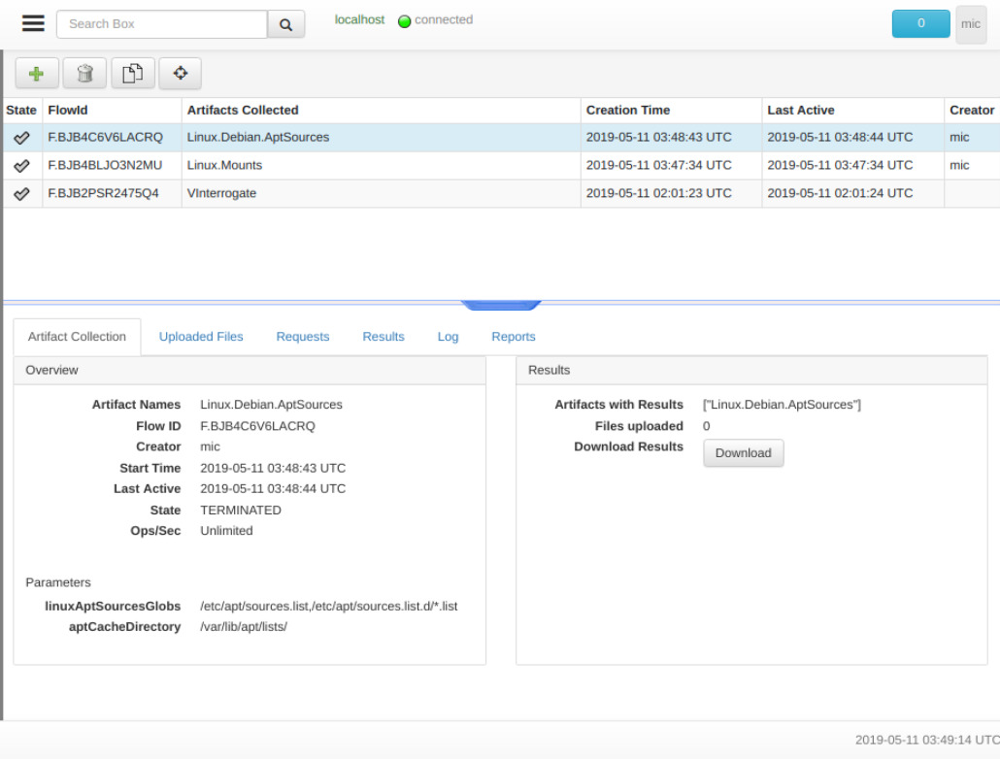

Now that we understand what artifacts actually are, we are ready to
collect artifacts from our endpoints. We will first discuss how to
collect an artifact from a single endpoint, and later discuss how to
hunt for the artifacts across the entire fleet.

Once we searched and selected the endpoint of interest, we can switch
to the "Collected Artifacts" view.

This page shows the artifacts previously collected on this
endpoint. The page is split into a top table showing a list of
collected artifacts, and a bottom overview pane showing details about
each selected artifact in the table above.

The artifacts list table shows an overview of previously collected
artifacts on this endpoint. Each artifact collection operation is
termed a `flow` in Velociraptor. It has the following columns:

1. The state of the flow. This can be a tick for completed flows, a
   clock for pending artifacts or a nuke for artifacts which were
   collected with critical errors (Artifacts may also have non
   critical errors so you need to check the logs as well).

2. The `FlowId` is a unique internal ID given to each flow
   Velociraptor runs. You will need this ID if you need to compose VQL
   quries for post processing the flow.

3. The `Artifacts Collected` column is a list of artifacts collected
   by this flow. It is possible to schedule multiple artifacts to be
   collected at the same time. This column shows each artifact by
   name.

4. The `Creation Date` is when the artifact was created. The endpoint
   may not have been online when we issued the collection request, so
   it is possible that the endpoint actually collected the artifact at
   a later time.

5. The `Last Active` date is when the last response arrived from the
   endpoint relating to this flow. The difference between this time
   and the creation time gives us an idea of how long the artifacts
   actually took to be collected on the endpoint.

6. Finally we learn the user that created the collection. If this
   column contains a hunt id (of the form `H.XXXX`) then this flow was
   automatically created by the hunt manager.

## The artifact details pane

The bottom pane allows us to inspect the flow and the collected
artifacts. It consists of several tabs, the first of which `Artifact
Collection` tab gives high level overview of the flow. We can see how
many files were uploaded, what artifacts were collected and any
specific artifact parameters that were issued.

In particular that tab also offers a `Download Results`
button. Clicking this button will create a zip file containing all
relevant information obtained from this artifact. Specifically it
contains a CSV file for each returned VQL query, as well as any files
uploaded by the artifact.

{}

There is no way to know currently how large the exported zip file will
be, as the Zip file is built on the fly. Therefore there is no
progress bar either as the file is downloaded.

{}

The `Uploaded Files` tab shows the files uploaded by the artifact's
VQL. Some artifact are simply file collectors - collecting a bunch of
files for later post processing analysis.

The `Results` tab shows a table of VQL results from each source. For
artifacts containing multiple sources (or if you collected multiple
artifacts) the selector allows switching between them to view the
result table from each. Since an artifact `source` is simply a VQL
query, it returns a single table with columns specified by the query
itself. Therefore each artifact source will produce a different table.

The `Logs` tab shows any messages logged by the endpoint while
collecting the artifact. Many issues encountered by the endpoint are
not considered fatal, but are nevertheless logged to the server (for
example, if the endpoint attempts to open a file which is locked). You
should look at the tab to assess if you are getting a complete result.

Finally the `Reports` tab shows the artifact's report. As described
above, the report is a human readable document explaining the results
of the artifact and performing some post processing.

## Collecting an artifact from an endpoint.

We have seen how to examine older artifacts collected from the
endpoint, how do we collect newer artifacts?

Clicking the plus button on the toolbar (`Collect More Artifacts`)
presents the artifacts collection UI.

The UI element presents a search box for finding the desired
artifacts. Velociraptor will search for the keywords in the artifact's
description field. A list of matching artifact names is presented
below the search box. Clicking on each of these artifacts presents a
summary of the artifact on the right hand side. The summary includes
the description as well as the parameters the artifact takes and the
VQL queries that will be run. The artifact can now be added to the
selected artifacts box.

### Controlling endpoint performance

Some artifacts have to perform many operations on the endpoint. For
example, image if we were looking for a particular file matching a
given hash. We would have to hash all files on the endpoint and then
compare the has to the required hash. This may negatively impact on
the endpoint performance.

Velociraptor offers two settings to allow you to decide how much
impact you want to have on the endpoint.

You can set the `Ops/Sec` value for collecting the artifacts. This
setting controls how aggressively the endpoint will collect the
artifact. For artifacts that collect a lot of files or otherwise
utilize heavy resources on the endpoint, it is advisable to lower this
to reduce endpoint load. An operation is considered a single row or
1mb scanned, so setting this value to 20 Ops/sec would result in a
yara scan of approximately 20Mb/s. Values between 1 and 50 should be
set here.

The `Maximum Time` setting controls how long Velociraptor will allow
the artifact query to run. Artifacts that take longer than this time
(by default 10 minutes) will be canceled. Velociraptor uses this
timeout to ensure artifacts do not run out of control on the
endpoint. If your artifact requires examining many files, or you have
lowered Ops/Sec to reduce its impact on the endpoint (but this will
make it take longer), you should increase this value.

## The File Finder Artifact

Artifacts can take parameters. When you add an artifact to the
"Selected Artifact" UI the Artifact's parameters also appear in the UI
for you to adjust. The parameters are should be properly filled with
reasonable defaults already so you only need to adjust them sometimes.

One of the most useful artifacts is the File Finder:

The File Finder allows you to search for files in the endpoint using a
number of criteria:

1. The Glob is a search pattern of files

2. If you want to search the contents of files you can specific a number of keywords here.

3. `Use Raw NTFS` specifies that raw NTFS parsing should be used -
   this is important for locked files like registry hives.

4. `Upload Files` specifies that matching files will be uploaded to the server

5. `Calculate Hash` specifies that hashes will be calculated of matching files.

6. It is also possible to set date ranges for file matches.

## Inspecting the results of an artifact

When an artifact runs on the endpoint, Velociraptor's VQL engine may
log messages about problems it encounters along the way.

For example in the above screenshot we see that some files were not
opened by the query because they were locked, but the query uploaded
216 rows and 205 files to the server.

You should inspect the log output to ensure that the artifact is
collected without errors. Although the artifact collection in this
case was mostly successful (it fetched most of the browser artifacts),
a few files were not able to be retrieved. This may or may not be
significant to your case.
