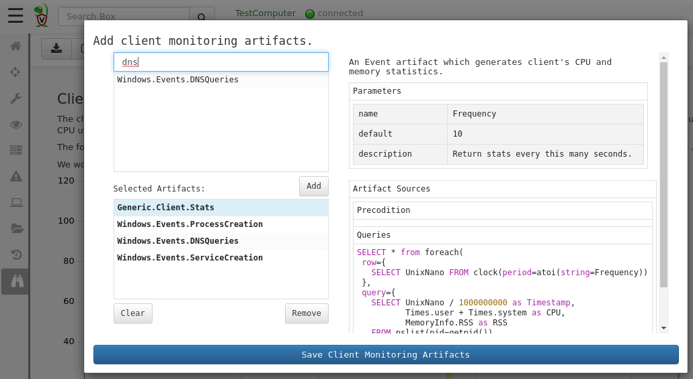
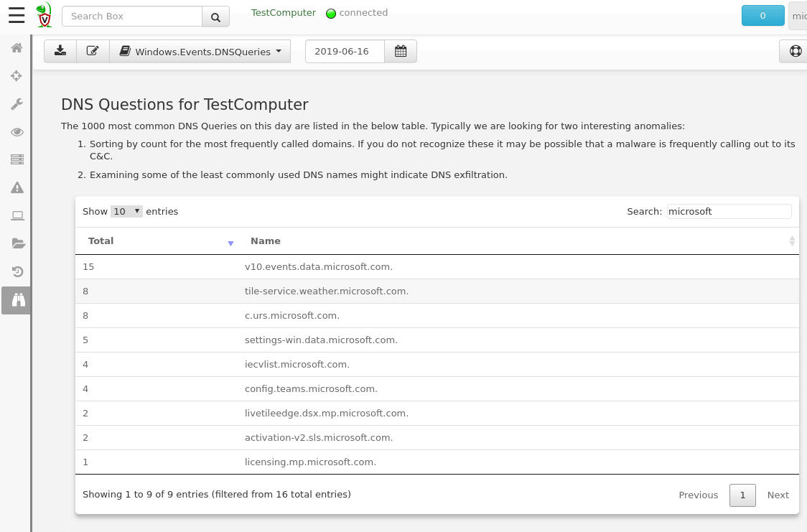

Velociraptor's VQL language is unique in that it allows queries to run
in the background and take a long time without using CPU
resources. This means that VQL is an asynchronous streaming query
engine.

Velociraptor has a number of VQL plugins which simply block, waiting
for events to occur (These are termed `Event plugins`). When an event
occurs, the query returns the event as a single row which is then
streamed to the server to be recorded.

We are able to use this to implement monitoring rules on the endpoint
as never ending VQL queries. The Velociraptor server has a list of
event artifacts to run on endpoints. When a new endpoint connects, it
receives this list of artifacts and begins running them in parallel -
and thereby we begin monitoring the endpoint for the specific events
we are interested in.

## Inspecting client events

Lets start by inspecting some events from the endpoint. By default,
Velociraptor collects the `Generic.Client.Stats` artifact. This
artifact samples the Velociraptor process's memory and CPU usage
footprint every 10 seconds. This artifact is useful to ensure that
Velociraptor's impact on the endpoint is acceptable.

Let's see what our Velociraptor client impact was on June 16. Select
`Client Events` in the navigation bar and `Generic.Client.Stats` in
the pulldown. You can change the date of interest in the date
selector.

{}

The `Client Events` screen renders a report which is defined within
the artifact itself. This means you can customize the report, or write
your own report. See [Report Templates]() for more about customizing your own reports.

{}

## Updating client event monitoring

The Velociraptor server maintains a list of client event artifacts to
monitor. You can update this list by clicking the "Update client
monitoring artifacts" button.

You can search for client monitoring artifacts to add. Highlighting an
existing artifact will display its description and may also add any
potential parameters.

In the example above we are monitoring process execution logs via the
`Windows.Events.ProcessCreation` artifacts. Let us add also monitor
the endpoint DNS queries via the `Windows.Events.DNSQueries` artifact
by adding it, and clicking `Save Client Monitoring Artifacts`.

As soon as you save this, clients will begin streaming these events to
the server. In this case every DNS query performed on the endpoint
will be recorded on the server.

Let's look at the DNSQueries performed by this specific endpoint on
the 16th June:

The DNS Artifact's report produces a table of frequency of the DNS
names queried over the day. The table may be filtered (in this case we
check for lookups to any `microsoft` domain), and sorted (by lookup
count). This allows us to see if there are excessive connections to
particular domains - these might indicate a C&C connection!
