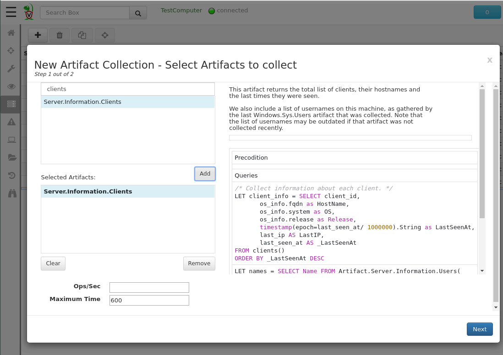
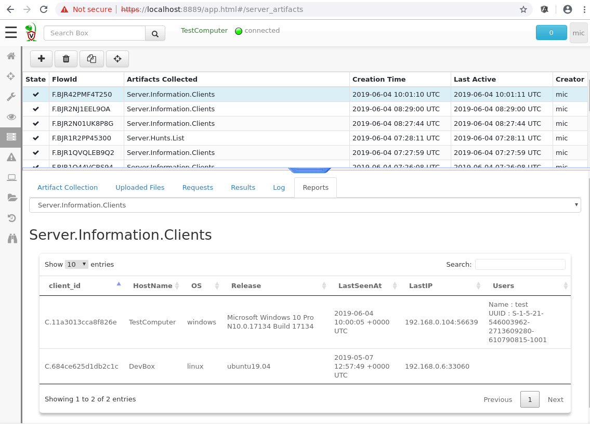

We have seen how Velociraptor's VQL language is used to query clients
for artifacts relevant to our investigation. It is also possible to
run VQL queries on the server in much the same way. On the server, VQL
exposes functionality making it possible to manage the server
deployment, as well as post process and correlate results from the
entire deployment.

In exactly the same way, server side VQL queries are encapsulated in
`Server Artifacts`.

{}

`Server Artifacts` run once and produce a fixed output at an instance
in time. They are not the same as `Server Event Artifacts` which run
continuously and generate daily event logs.

{}

Since server artifacts do not themselves collect any information from
the client, typically Server Artifacts are used to post process client
collections in some way or to perform administrative tasks.

## Running a Server Artifact

To run a Server Artifact select the `Server Artifact` option in the
side navigation bar, then click the `Collect More Artifacts` button.

In the above example we will collect the `Server.Information.Clients`
artifact which just lists all the clients, and the users associated
with them (This is an example of a server artifact which post
processes the `Windows.Sys.Users` artifact)

We can now download the list of all clients, and some information
about each client as obtained at this instance in time.
