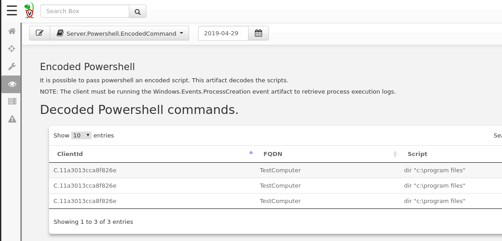
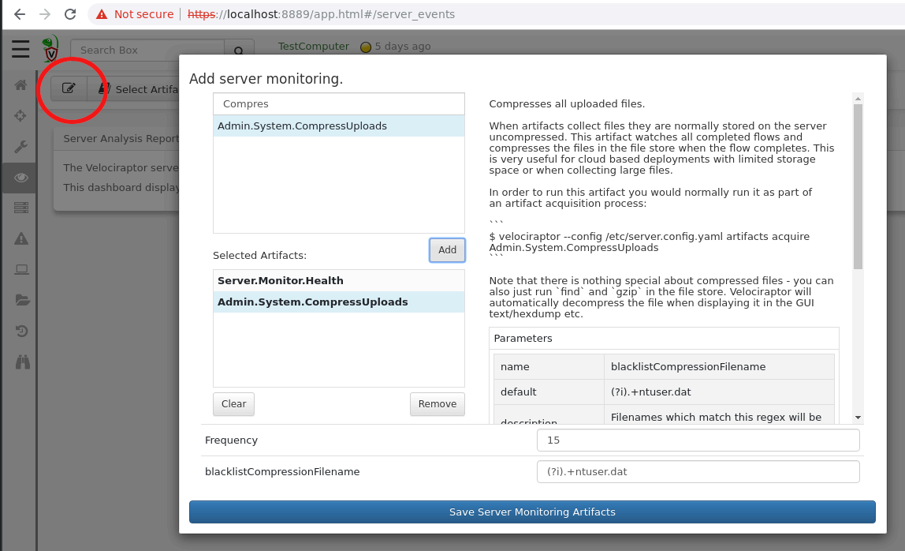

We have seen how client event VQL queries are run on endpoints and
stream client side events to the server. In a similar way, event
queries can run on the server to watch for events server side.

Typically server event artifacts monitor the server for the occurrence
of some conditions. When these conditions are detected, the artifact
will emit a row.

Selecting `Server Events` in the UI shows a similar screen to the
`Client Events` selection, except that we are now looking at server
monitoring artifacts.

In the above example, we see the `Server.Powershell.EncodedCommands`
artifact. This artifact monitors the process execution logs from all
clients (as collected by the `Windows.Events.ProcessCreation` client
monitoring artifact) and when a Powershell process with encoded
scripts are run, it simply decodes the script.

{}

Powershell is a common tool used by many adversaries for lateral
movement. Typically attackers encode their malicious scripts so they
can be sent over remote connections. This makes it difficult to see
what the command will do when looking at a plain process execution
log. The `Server.Powershell.EncodedCommands` simply decodes these for
further inspection.

{}

## Updating server event monitoring

The Velociraptor server maintains a list of server event artifacts to
monitor. You can update this list by clicking the "Update server
monitoring artifacts" button.

You can search for server monitoring artifacts to add. Highlighting an
existing artifact will display its description and you may also add
any potential parameters.

In the example above we are adding the `Admin.System.CompressUploads`
artifact which compresses uploads as soon as they are collected from
endpoints in order to keep server disk usage to a minimum.

{}

The `Admin.System.CompressUploads` artifact is an example of a server
event monitoring artifact specifically designed to post process a
specific type of collected files. In this case we watch for the
collection flow to complete, then simply compress all files
uploaded. However one can think of similar post processing scenarios
such as parsing file of a particular type, or uploading the files to
virus reputation sites (e.g. Virus Total). Your imagination is really
the limit of what can be done using this mechanism.

{}
