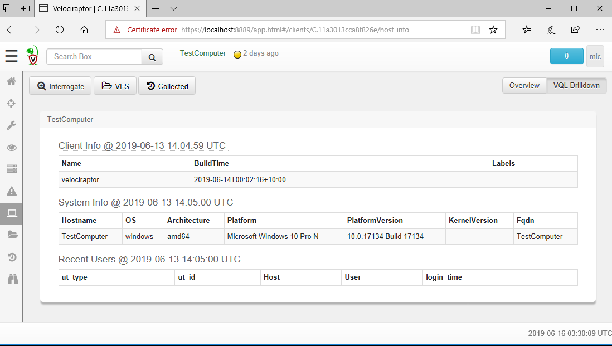

Before we can interactively examine a client, we need to select it in
the GUI.  The best way is to search for it. The search bar is present
at the top of every page making it easily accessible. Just start
typing a search term and the UI will suggest matches.


We may search for the client by host name, label or client id. Simply
click on the search bar without any search term to show some random
clients. The search box features a type ahead completion, so simply
start typing the hostname and Velociraptor will show some suggestions.

Alternatively it is possible to apply regular expressions to the
search term and all hosts matching will be retrieved. Prefixing the
search test with `host:` will only search for hostnames, `label:` will
only search labels.

{}

Internally each client has a unique client ID - Velociraptor uses the
client Id to distinguish between hosts, rather than the hostname. This
is done since a hostname is not a reliable unique indicator of an
endpoint. Many systems change their hostname frequently based on DHCP
settings, or even multiple machines may be assigned the same hostname
due to misconfiguration. Velociraptor always uses the unique client id
for the host, but will usually also show the host's fully qualified
domain name (FQDN) as well.

{}


The results from the search are shown as a table.


The table contains three columns:

1. The online state of the host is shown as a color icon. A green dot
   indicated that the host is currently connected to the server, a
   yellow icon indicates the host is not currently connected but was
   connected less than 24 hours ago. A red icon indicates that the
   host has not been seen for 24 hours or more.

2. The client ID of the host is shown.

3. The hostname reported by the host.

4. The operating system version. This indicates if the host is a
   Windows/Linux/OSX machine and its respective version.

5. Any labels applied to the host.

## Labels

Hosts may have labels attached to them. A label is any name associated
with a host. Labels are useful when we need to hunt for a well defined
group of hosts, then we can restrict the hunt to one or more labels to
avoid collecting unnecessary data or accessing machines we should not
be.

It is possible to manipulate the labels via the search screen. Simply
select the hosts in the GUI and then click the "add labels" button.


Although it is possible to manipulate labels via the GUI, It is
usually easier to use VQL queries to add or remove labels via the
[label()]() plugin.

For example, the following query labels all machines that the user
"mike" ever logged into (Where HuntId is set to a
`Windows.Sys.Users` artifact collector hunt ID:

```text
SELECT Name, label(client_id=ClientId,
                   labels="Mikes Box",
                   op="set")
FROM hunt_results(hunt_id=HuntId,
                  artifact="Windows.Sys.Users")
WHERE Name =~ "mike"
```


### Built-in Labels

While one can add labels to machines using the GUI this is not
practical for labeling very large numbers of client, for example
belonging to a particular Active Directory Organizational Unit
(OU). It is reasonable to want to quickly select those machines
belonging to a particular OU.

We can use labels to identify machines installed by a specific group
policy. For example, suppose we have a particular OU called
`Sales`. We want to ensure that Velociraptor clients in the Sales team
are specifically marked by the `Sales` label.

Simply modify the client's configuration file as obtained in the
[Agentless Deployment Mode]() to contain the Sales label:

```yaml
Client:
  labels:
  - Sales
```

Then we apply the Group Policy Object only on the Sales OU which will
result in those clients being enrolled with the Sales label
automatically.


## Selecting a client

Clicking on any client in the search screen will switch the GUI to
client mode. This will now present information relevant to the
selected client.

You can easily tell which client we are dealing with as the name of
the host, and the last time we connected with it are shown:


Velociraptor maintains some basic information about the host, such as
its hostname, labels, last seen IP and last seen time. This is shown
in the `Host View` pane. Velociraptor uses this information to make it
possible to search for this host and target it for further
investigation. Velociraptor gathers this information during the
`Interrogate` operation. Interrogation normally occurs when the client
first enrolls, but you can interrogate any client at any time by
clicking the `Interrogate` button.

Ultimately, interrogation simply runs a bunch of VQL queries on the
endpoint. We can issue arbitrary VQL and have it appear in the `VQL
Drilldown` page.




To add arbitrary VQL queries to the drill-down simply populate them in
the configuration file. For example the following also collect the
endpoint's uptime:

```yaml
Flows:
  interrogate_additional_queries:
     - Name: Uptime
       VQL:  "SELECT Uptime from info()"
```

{}

The VQL Drilldown simply shows the results from running the VQL
queries on the client. The time when those were run is shown, as well
as the actual query run is visible by hovering over the title.

{}
